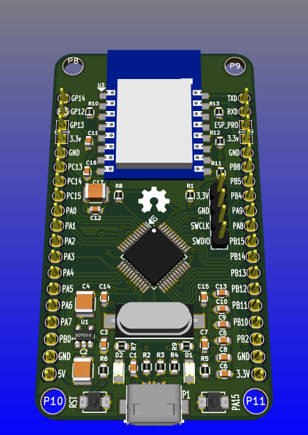

# Thông tin chung về dự án iot-core

Phần cứng IoT core kết hợp STM32 + ESP8266:

- Chip ESP8266 có kết nối Wifi tuy nhiên lại có nhiều hạn chế về phần cứng như thiếu các giao tiếp ngoại vi và USB, thiếu module đọc Analog chính xác, thiếu IO... trong khi việc phát triển Ứng dụng trên ESP8266 bắt buộc cần giao tiếp USB-Serial. Chính vì vậy nhiều module trên thế giới xuất hiện thêm con chip USB-TTL, ngoài giá trị cho việc develop thì ít có giá trị trong thực tế. Thiết kế này sẽ sử dụng STM32 giá rẻ, bổ sung giao tiếp USB, hỗ trợ cho việc develop, và có các module mà ESP8266 thiếu hụt.

- Dự án IoT core bao gồm các dự án con:
    + [iot-core-hw](https://github.com/genuine-engineering/iot-core-hw) Phần cứng vẽ bằng [KiCad](http://kicad-pcb.org/)
    + [iot-core-stm32-fw](https://github.com/genuine-engineering/iot-core-stm32-fw) Firmware cho STM32 dựa trên [libopencm3](https://github.com/libopencm3/libopencm3)
    + [iot-core-esp8266-fw](https://github.com/genuine-engineering/iot-core-esp8266-fw) Firmware cho ESP8266 dựa trên [Espressif SDK 2.0](https://espressif.com/en/support/download/sdks-demos)

# iot-core-hw
## Tổng quan
Phần cứng được phát triển dựa trên phần mềm [KiCad](http://kicad-pcb.org/), bao gồm 2 thành phần chính là ESP8266 và STM32F103C8T6
- STM32 giao tiếp USB, kết nối với ESP8266 thông qua giao tiếp UART
- Các chân ngõ ra của STM32 và ESP8266 được đưa ra ngoài 
- Mạch in 1mm, Fr4, in đỏ, mạ vàng, sẽ được đặt hàng ở nhà Cung cấp chất lượng

## Sơ đồ nguyên lý

## Mạch in PCB

## 3D

## Gerber file 
